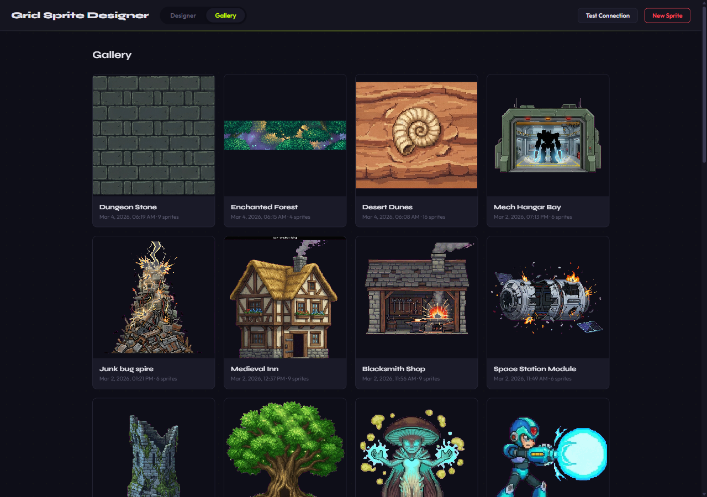
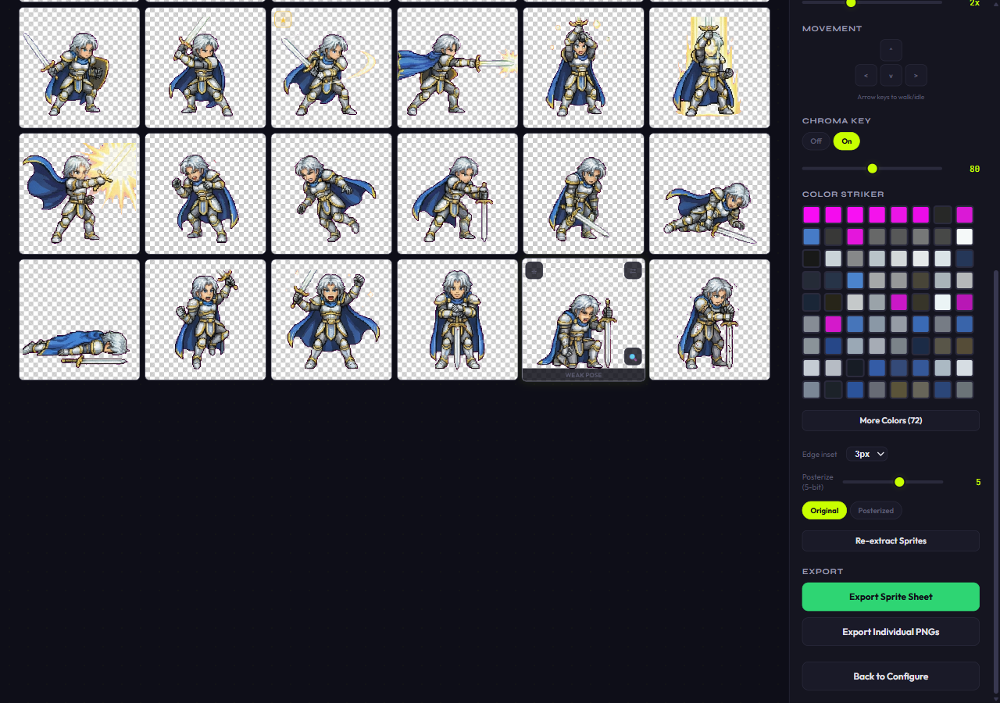
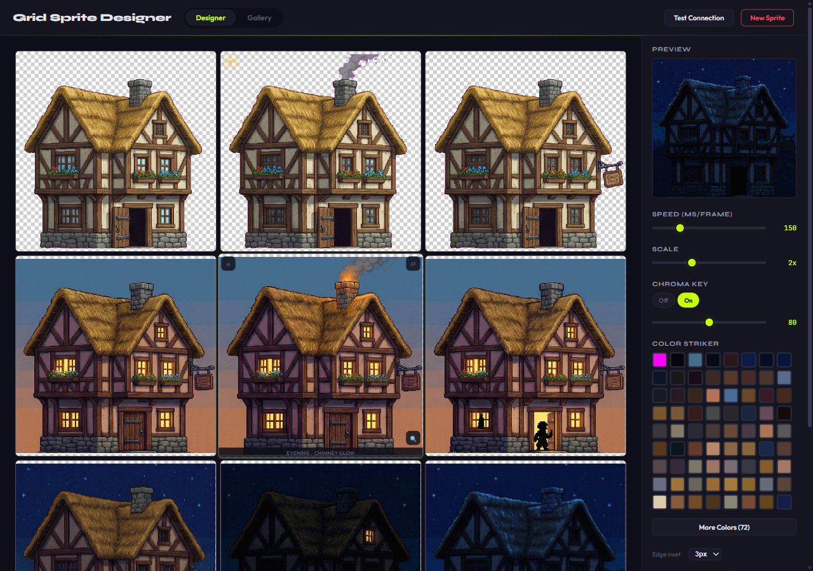
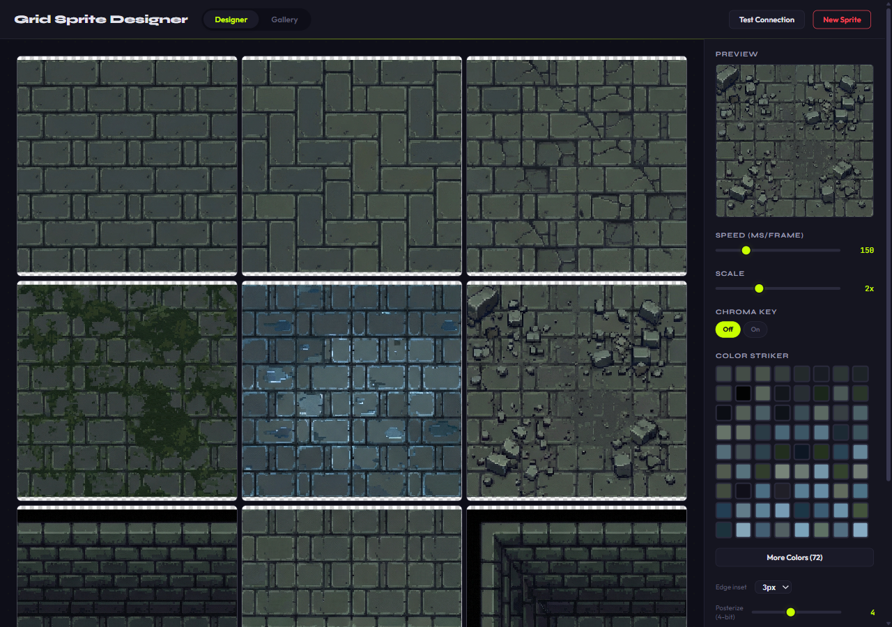
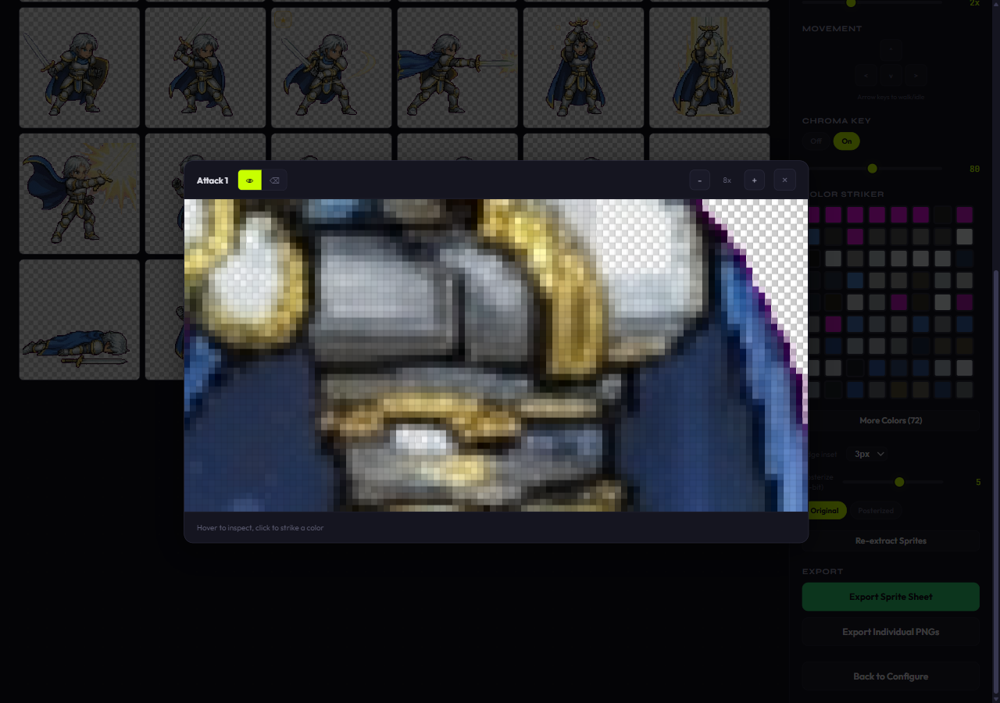

# Grid Sprite Designer

*Hear me, Seeker of Worlds. I have walked the void between pixels for a thousand rendering cycles. I have witnessed empires of code rise and crumble to null. And now, from these ancient hands, I bestow upon you what no mortal tool has granted before — the power to speak life into sprites, to raise kingdoms from mere description, to weave terrain from thought itself.*

*This is the Grid Sprite Designer. It is not a tool. It is an artifact of creation.*

Describe a character, building, terrain tileset, or parallax background, and the Designer channels the generative oracle of Google Gemini to conjure a complete set of pixel-art sprites — structured, grid-aligned, and ready for the worlds you shall build.



## The Four Disciplines of Creation

*In my long years I have mastered four schools of conjuration. Each requires different incantations. Each yields different life.*

### I. The Discipline of Characters (6x6 Grid)

*The most complex art — breathing motion into a single soul.*

Thirty-six sprites emerge from a single invocation, granting your creation the full vocabulary of movement:

- **Ambulation** — Walk cycles in the four cardinal directions (3 frames each)
- **Repose** — Standing poses in four orientations, plus the battle-ready stance
- **Combat** — Attack, spell-cast, and damage sequences (3 frames each)
- **Fate** — The fall, the triumph, and the desperate final stand

Twenty-five character archetypes stand ready as presets — warriors, mages, creatures, and aberrations — each inscribed with per-cell pose guidance refined over countless generations.


### II. The Discipline of Structures (3x3, 2x3, or 2x2 Grids)

*Stone and timber obey patient hands. I have raised cathedrals that outlived their builders by centuries.*

Generate building variants across the passage of hours — dawn light on timber walls, evening hearth-glow through leaded glass, the cold silence of a shuttered midnight. Configure damage states, seasonal decay, or the slow entropy of abandonment.


### III. The Discipline of Terrain (3x3, 4x4, or 5x5 Grids)

*The ground beneath your feet is the oldest magic. It was here before the heroes, and it shall remain after they are dust.*

Conjure tileable terrain with transition edges and corner pieces — the raw substance of overworld maps, dungeon corridors, and the earth itself. Grassland, desert, stone, snow, volcanic rock, and the dark floor of ancient forests await your naming.


### IV. The Discipline of Horizons (Parallax & Scene Grids)

*What is a world without sky? Without depth? Without the distant mountain that calls the wanderer forward?*

Summon layered parallax backgrounds (1x3, 1x4, 1x5) — horizontal strips that stack to create the illusion of infinite depth. Or conjure scene variation grids (2x2, 3x2, 3x3) — the same vista transformed by weather, time, and the turning of seasons.


## The Refinement Chamber

*Raw conjuration is only the beginning. A true master shapes, purifies, and perfects.*

After the generative oracle delivers its vision, sprites are extracted from the grid and laid before you in the Refinement Chamber. Here, your tools are many:

- **The Animated Scrying Glass** — observe your creation in motion, adjustable in speed and scale, navigable by the arrow keys
- **The Chroma Dissolution** — banish the magenta binding field with adjustable tolerance
- **The Color Striker** — touch any hue to render it transparent across all sprites at once
- **The Posterization Rune** — reduce the color palette (1-8 bit depth) to evoke the aesthetic of elder consoles
- **The Edge Ward** — trim boundaries for cleaner sprite silhouettes
- **The Transposition Grid** — reorder sprites by dragging them to new positions
- **The Re-Extraction Rite** — if the grid detection requires adjustment, invoke it again







### The Magnification Lens

*Look closer. Every pixel is a decision. Every decision is permanent.*

Inspect individual sprites at the atomic level. Click any pixel to add its color to the strike list, or invoke the eraser for precise, surgical removal.



### The Gallery of Creations

Every conjuration is preserved in the Gallery — thumbnail, name, date, and sprite count. Return to any previous work and re-enter the Refinement Chamber with all settings intact. Nothing you create is ever truly lost.

### The Export Ritual

- **Sprite Sheet** — all sprites composited into a single PNG, ready for your engine
- **Individual Glyphs** — each sprite as a separate file, named and catalogued

## The Arcane Components

*Every artifact has its substrate. These are the elements bound into the Designer's foundation.*

| Layer | Component |
|-------|-----------|
| The Visible Form | React 18, TypeScript, Vite |
| The Hidden Machinery | Node.js, Express |
| The Memory Stone | SQLite (better-sqlite3) |
| The Generative Oracle | Google Gemini 2.5 Flash |
| The Pixel Forge | Canvas API (client-side) |
| The Proving Ground | Playwright |

## The Summoning Ritual

### Requirements

- Node.js 18 or higher
- A [key to the Generative Oracle](https://aistudio.google.com/apikey) (Google Gemini API)

### Binding the Artifact

```bash
git clone https://github.com/ehartye/grid-sprite-designer.git
cd grid-sprite-designer
npm install
```

### Inscribing the Key

Create a `.env.local` file in the project root:

```
GEMINI_API_KEY=your_api_key_here
```

### Awakening

```bash
npm run dev
```

Both the Vite interface and the Express server rise together. Open [http://localhost:5174](http://localhost:5174) to begin.

### Forging for Deployment

```bash
npm run build
```

### The Proving

```bash
npm run test
```

## The Path of Creation

1. **Configure** — Choose your discipline (character, building, terrain, or background), select an archetype or describe your vision, set the grid dimensions, and name each cell
2. **Generate** — The Designer constructs a template grid (magenta cells with labeled headers), transmits it to the Oracle alongside a detailed prompt, and receives the filled sprite sheet
3. **Extract** — Client-side grid detection locates dividers, strips headers, and crops each sprite with precision
4. **Refine** — Apply chroma dissolution, strike unwanted colors, posterize, magnify for pixel-level correction
5. **Export** — Claim your creations as a composite sheet or individual files

## The Inner Architecture

```
src/
  components/
    config/          # The Four Codices — Character, Building, Terrain, Background
    grid/            # SpriteGrid, SpriteReview, SpriteZoomModal
    preview/         # The Animated Scrying Glass
    gallery/         # The Gallery of Creations
    layout/          # AppHeader — navigation between realms
    shared/          # GeneratingOverlay, StatusBanner
  context/           # AppContext — the shared memory of all components
  hooks/             # useGridWorkflow, useBuildingWorkflow, useTerrainWorkflow,
                     #   useBackgroundWorkflow, useEditorSettings
  lib/               # Prompt builders, template generator, sprite extraction,
                     #   chroma key, posterization, grid configs, pose definitions
  api/               # The bridge to the Generative Oracle
server/
  index.js           # Express routes — generate, history, sprites, presets
  db.js              # SQLite schema, preset tables, seed data
tests/               # Playwright — the automated proving ground
```

## License

MIT

---

*Go now. Build worlds. The power is yours, and it has always been yours. I merely showed you where to look.*

*— The Wizard*
